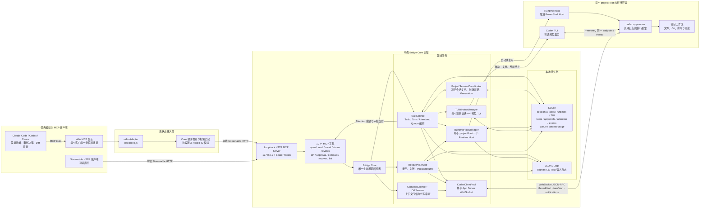

# Codex Bridge MCP 架构

## 1. 定位

Codex Bridge MCP 是任务编排者与 Codex App Server 之间的本地可靠会话层：

- Claude Code、Codex、Cursor 等 MCP 客户端负责理解需求、决策审批和审查结果；
- Codex App Server 负责在真实项目中执行 turn、修改代码和运行命令；
- Bridge 负责稳定保存项目会话、Task、Codex Thread、Turn、审批、事件、上下文和恢复状态。

Bridge 不通过 TUI 发送任务。正常执行始终走 App Server WebSocket JSON-RPC；可见 TUI 只连接同一个 Runtime 和 Thread，用于观察或人工交互。

## 2. 总体架构图



## 3. 关键调用链

### `task_open`

1. `ProjectSessionCoordinator` 将 Windows 路径规范化成稳定的 `projectKey`。
2. 默认 `mode=reuse`：复用项目当前的 Project Session、Task 和 Codex Thread；只有显式 `mode=new` 才推进 Session Generation 并创建隔离线程。
3. `RuntimeHostManager` 保证一个 `projectRoot` 只有一个活跃 Runtime Host。
4. 新 Task 只在这里调用 `thread/start`；已知线程恢复时才允许调用 `thread/resume`。
5. `TuiWindowManager` 复用或启动该 Project Session 的可见 TUI，并把 PID、Generation、Endpoint 和 Thread 持久化。

### `task_send`

1. 校验 Task、Runtime、Thread 和可见 TUI 仍属于同一个活跃项目会话。
2. 同一 Task 的命令进入串行队列，防止两个 `turn/start` 并发写入同一 Thread。
3. 正常后续指令只调用 App Server 的 `turn/start`，不启动 `codex resume`、Shell 或新的 Runtime。
4. Bridge 等待并持久化下一条 Attention：审批、完成、失败或中断。
5. 未 ACK 的 Attention 在客户端取消或重连后继续重放；不会因为 MCP 连接断开而丢失结果。

### 审批、审查与恢复

- App Server 的命令或文件审批请求先持久化，再交给编排者通过 `approval_decide` 明确批准或拒绝；Bridge 从不自动批准。
- Turn 完成后，编排者通过 `task_diff` 读取真实工作区差异；未通过验收时继续调用 `task_send`。
- Core 重启先进入 `RECONCILING`，使用 `thread/read` 对账本地活跃 Turn；Runtime 不可达时才重建 App Server，并对已知 Thread 调用 `thread/resume`。
- 上下文接近阈值时，`task_compact` 调用 `thread/compact/start`，不创建新 Thread。

## 4. 核心不变量

| 不变量 | 约束 |
| --- | --- |
| `projectRoot -> Runtime Host` | 一个规范化项目路径最多对应一个活跃 Runtime Host |
| `projectRoot -> Project Session` | 默认复用一个活跃项目会话；`mode=new` 才显式换代 |
| `Project Session -> TUI` | 一个活跃 Generation 最多一个可见 TUI；旧进程树未结束时不得启动替代窗口 |
| `taskId -> codexThreadId` | 一个 Task 永久绑定一个 Codex Thread |
| `thread/start` | 只允许由 `task_open` 创建新 Thread |
| `turn/start` | 正常后续工作唯一入口，只允许在同一 Task 队列中串行执行 |
| `thread/resume` | 只用于恢复或 Runtime 重连后重新加载已知 Thread |
| Approval | 只持久化和转发，不自动批准 |
| Attention | 先持久化、后交付、显式 ACK；未 ACK 时可重放 |
| Core ownership | SQLite、队列、WebSocket、Runtime、TUI 和恢复逻辑只由单例 Core 持有 |

## 5. 代码模块映射

| 架构组件 | 入口文件 |
| --- | --- |
| stdio Adapter | `src/index.ts`、`src/mcp/stdioProxy.ts` |
| Core Daemon 与 HTTP MCP | `src/daemon.ts`、`src/mcp/httpServer.ts` |
| Core 生命周期与依赖装配 | `src/core/bridgeCore.ts` |
| MCP 工具与 Schema | `src/mcp/tools.ts`、`src/mcp/schemas.ts` |
| Task / Turn / Attention 编排 | `src/task/taskService.ts`、`src/task/taskQueue.ts` |
| Project Session | `src/task/projectSessionCoordinator.ts` |
| Runtime Host | `src/runtime/runtimeHostManager.ts`、`src/runtime/powershellScriptBuilder.ts` |
| 可见 TUI | `src/runtime/tuiWindowManager.ts` |
| App Server WebSocket | `src/codex/codexAppServerClient.ts` |
| App Server 事件与审批适配 | `src/codex/eventNormalizer.ts`、`src/codex/approvalAdapter.ts` |
| 恢复与上下文压缩 | `src/task/recoveryService.ts`、`src/task/compactService.ts` |
| Diff 审查 | `src/review/diffService.ts` |
| SQLite 与 JSONL | `src/storage/sqlite.ts`、`src/storage/schema.sql`、`src/storage/jsonlLogger.ts` |

## 6. Core 生命周期

```text
STOPPED -> STARTING -> RECONCILING -> READY -> DRAINING -> STOPPED
```

- `STARTING`：创建 SQLite、日志、Client Pool 和领域服务；
- `RECONCILING`：对账未完成 Turn、队列、审批和 Runtime 状态；
- `READY`：接受 MCP 工具调用；
- `DRAINING`：停止接收新请求，关闭 MCP 会话、App Server WebSocket 和 SQLite。

单个 stdio 客户端退出不会关闭 Core，因此不会中断已经提交的 Codex Turn，也不会触发第二套 Runtime 或全库恢复。
